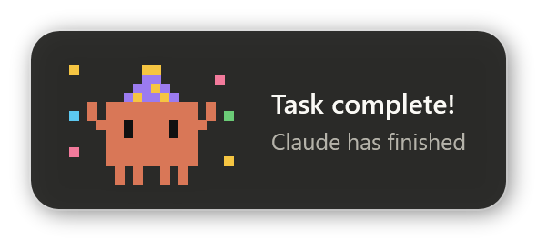
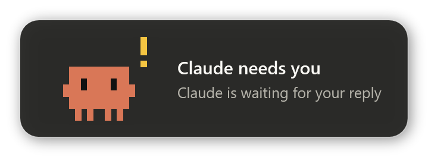
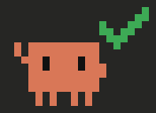
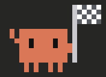

# Clawd Notify

[Русский](README.md) · **English**

Replace the plain Windows toast from Claude Code with **Clawd**, the little orange Claude mascot,
who slides in from the corner of the screen, strikes a random pose and plays a tiny 8-bit jingle.

<p align="center">
  
  
</p>

- **12 animated poses**, picked at random every time
- **Two events:** *task complete*, and *Claude needs you* (permission requests and questions)
- **Chiptune sound** synthesized on the fly: no audio files, no dependencies
- **Stacks** when several sessions finish at once, **never steals focus**, pauses while you hover, click to dismiss
- English and Russian UI (auto-detected)
- Pure PowerShell + WPF, which Windows already has. Nothing to install besides the scripts.

## Poses

| | | | |
|:-:|:-:|:-:|:-:|
| <br>`cheer` | <br>`wave` | <br>`laptop` | <br>`coffee` |
| <br>`party` | <br>`love` | <br>`dance` | <br>`trophy` |
| <br>`check` | <br>`finish` | <br>`alert` | <br>`confused` |

*Task complete* uses the first ten. *Claude needs you* uses `alert`, `confused` and `wave`.
Static PNGs of every pose are in [`poses/`](poses).

## Requirements

- Windows 10 or 11 (uses the built-in Windows PowerShell 5.1)
- [Claude Code](https://claude.com/claude-code): the CLI, the desktop app or an IDE extension. Anything that runs Claude Code hooks.

## Install

**One command** (downloads to `%LOCALAPPDATA%\clawd-notify` and registers the hooks):

```powershell
irm https://raw.githubusercontent.com/AndrewPythonist/clawd-notify/main/install.ps1 | iex
```

**Or from a clone** (the hooks will point to the cloned folder, so keep it where it is):

```powershell
git clone https://github.com/AndrewPythonist/clawd-notify.git
cd clawd-notify
powershell -ExecutionPolicy Bypass -File install.ps1
```

The installer adds two hooks to `~/.claude/settings.json`, keeps all your other settings and
saves a backup as `settings.json.bak`. Running it again updates in place without adding duplicates.
Clawd waves hello when it's done.

Then:

1. **Start a new Claude Code session.** Hooks are read when a session starts.
2. **Using the Claude desktop app?** Turn off its own notifications in the app's settings,
   otherwise you'll get both the standard toast and Clawd.

## Try it

```powershell
# a random "task complete" pose
powershell -ExecutionPolicy Bypass -File clawd-popup.ps1

# a specific pose / event / language
powershell -ExecutionPolicy Bypass -File clawd-popup.ps1 -Variant party
powershell -ExecutionPolicy Bypass -File clawd-popup.ps1 -Kind attention -Lang en
```

## Customize

| What | Where |
|---|---|
| Language | Detected from Windows. Force it with the `CLAWD_LANG` environment variable (`en` / `ru`). |
| How long it stays | `[int]$Seconds = 6` in `clawd-popup.ps1` |
| Volume and melodies | `$volume` and `$melody` in `clawd-popup.ps1` |
| Poses | `clawd-poses.ps1`: each frame is the base Clawd plus pixel edits like `'17,0-2=Y'` (yellow pixels in column 17, rows 0–2). Run `tools\render-poses.ps1` to regenerate the images in `poses/`. |

## How it works

```
Claude Code ──Stop / Notification hook──▶ clawd-notify.ps1 ──start detached──▶ clawd-popup.ps1
                (JSON on stdin)             reads event,                        WPF window, pixel-art
                                            exits in <1 s                        Clawd, chiptune
```

- **`Stop`** fires when Claude finishes responding → *Task complete!* with the project folder name.
- **`Notification`** with matcher `permission_prompt|elicitation_dialog` → *Claude needs you* with Claude's message.
  The idle "still waiting" reminder is deliberately skipped.
- The hook script exits immediately, so Claude is never kept waiting. The popup runs in its own hidden process.
- The jingle is synthesized once and cached in `%TEMP%\clawd-notify`.

## Uninstall

```powershell
powershell -ExecutionPolicy Bypass -File "$env:LOCALAPPDATA\clawd-notify\uninstall.ps1"
```

(or run `uninstall.ps1` from your clone). This removes only the Clawd hooks. Then delete the folder.

## Project layout

```
clawd-notify.ps1      hook entry point
clawd-popup.ps1       the popup window, animation and sound
clawd-poses.ps1       pixel data for all poses
install.ps1           registers the hooks
uninstall.ps1         removes them
tools/render-poses.ps1  regenerates poses/*.gif, poses/*.png and docs/*.png
```

## License

[MIT](LICENSE).

This is an unofficial fan project and is not affiliated with or endorsed by Anthropic.
Claude and Clawd are trademarks of Anthropic.
