# Clawd Notify

[English](README.md) · **Русский**

Заменяет стандартное уведомление Windows от Claude Code на **Clawd**, маленького оранжевого маскота Claude.
Он выезжает из угла экрана, принимает случайную позу и проигрывает короткую 8-битную мелодию.

<p align="center">
  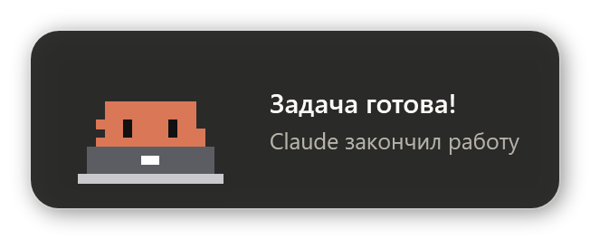
  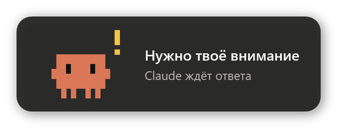
</p>

- **12 анимированных поз**, каждый раз случайная
- **Два события:** «задача готова» и «нужно твоё внимание» (запрос разрешения или вопрос от Claude)
- **Чиптюн-звук** синтезируется на лету: без аудиофайлов и зависимостей
- Несколько уведомлений сразу **встают стопкой**; окно **не забирает фокус**, при наведении мыши ждёт, по клику закрывается
- Интерфейс на русском или английском (по языку Windows)
- Только PowerShell и WPF, которые уже есть в Windows. Ставить ничего, кроме скриптов, не нужно.

## Позы

| | | | |
|:-:|:-:|:-:|:-:|
| 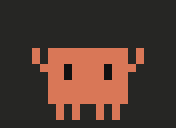<br>`cheer` | 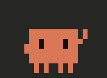<br>`wave` | 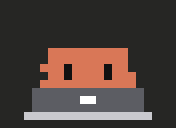<br>`laptop` | 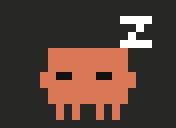<br>`sleepy` |
| 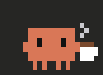<br>`coffee` | 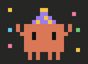<br>`party` | 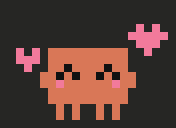<br>`love` | 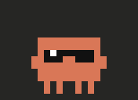<br>`cool` |
| 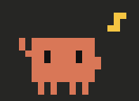<br>`dance` | 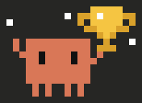<br>`trophy` | 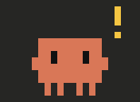<br>`alert` | 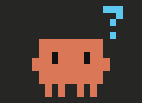<br>`confused` |

«Задача готова» выбирает из первых десяти поз, «нужно внимание» — из `alert`, `confused` и `wave`.
Статичные PNG всех поз лежат в [`poses/`](poses).

## Что нужно

- Windows 10 или 11 (используется встроенный Windows PowerShell 5.1)
- [Claude Code](https://claude.com/claude-code): CLI, десктоп-приложение или расширение для IDE. Подойдёт всё, что выполняет хуки Claude Code.

## Установка

**Одной командой** (скачает файлы в `%LOCALAPPDATA%\clawd-notify` и подключит хуки):

```powershell
irm https://raw.githubusercontent.com/AndrewPythonist/clawd-notify/main/install.ps1 | iex
```

**Или из клона репозитория** (хуки будут указывать на эту папку, так что не перемещайте её):

```powershell
git clone https://github.com/AndrewPythonist/clawd-notify.git
cd clawd-notify
powershell -ExecutionPolicy Bypass -File install.ps1
```

Установщик добавляет два хука в `~/.claude/settings.json`, сохраняет все остальные настройки
и делает резервную копию `settings.json.bak`. Повторный запуск просто обновляет хуки, без дублей.
В конце установки Clawd помашет вам рукой.

Дальше:

1. **Откройте новую сессию Claude Code.** Хуки читаются при старте сессии.
2. **Пользуетесь десктоп-приложением Claude?** Выключите в его настройках собственные уведомления,
   иначе будут приходить и обычный тост, и Clawd.

## Попробовать

```powershell
# случайная поза «задача готова»
powershell -ExecutionPolicy Bypass -File clawd-popup.ps1

# конкретная поза / событие / язык
powershell -ExecutionPolicy Bypass -File clawd-popup.ps1 -Variant party
powershell -ExecutionPolicy Bypass -File clawd-popup.ps1 -Kind attention -Lang ru
```

## Настройка

| Что | Где |
|---|---|
| Язык | Определяется по Windows. Задать вручную: переменная окружения `CLAWD_LANG` (`ru` / `en`). |
| Сколько висит окно | `[int]$Seconds = 6` в `clawd-popup.ps1` |
| Громкость и мелодии | `$volume` и `$melody` в `clawd-popup.ps1` |
| Позы | `clawd-poses.ps1`: каждый кадр — это базовый Clawd плюс правки пикселей, например `'17,0-2=Y'` (жёлтые пиксели в столбце 17, строки 0–2). После правок запустите `tools\render-poses.ps1`, чтобы обновить картинки в `poses/`. |

## Как это работает

```
Claude Code ──хук Stop / Notification──▶ clawd-notify.ps1 ──запуск отдельно──▶ clawd-popup.ps1
                (JSON в stdin)             читает событие,                       WPF-окно, пиксельный
                                           выходит за <1 с                       Clawd, чиптюн
```

- **`Stop`** срабатывает, когда Claude закончил отвечать → «Задача готова!» и имя папки проекта.
- **`Notification`** с matcher `permission_prompt|elicitation_dialog` → «Нужно твоё внимание» и сообщение от Claude.
  Напоминание «Claude всё ещё ждёт» специально пропускается.
- Скрипт хука завершается сразу, так что Claude никогда не ждёт. Окно работает в отдельном скрытом процессе.
- Мелодия синтезируется один раз и кэшируется в `%TEMP%\clawd-notify`.

## Удаление

```powershell
powershell -ExecutionPolicy Bypass -File "$env:LOCALAPPDATA\clawd-notify\uninstall.ps1"
```

(или запустите `uninstall.ps1` из клона). Удаляются только хуки Clawd. После этого можно удалить папку.

## Структура

```
clawd-notify.ps1      точка входа для хуков
clawd-popup.ps1       окно, анимация и звук
clawd-poses.ps1       пиксельные данные всех поз
install.ps1           подключает хуки
uninstall.ps1         отключает их
tools/render-poses.ps1  перегенерирует poses/*.gif, poses/*.png и docs/*.png
```

## Лицензия

[MIT](LICENSE).

Это неофициальный фан-проект, не связанный с Anthropic и не одобренный ею.
Claude и Clawd — товарные знаки Anthropic.
